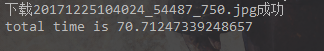
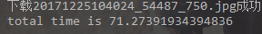
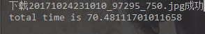
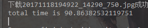
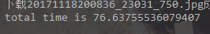
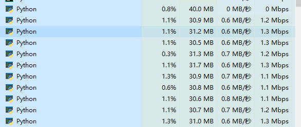
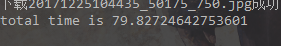

## concurrent.futures.ThreadPoolExecutor

### ThreadPoolExecutor.submit

这次用的资源是CosPlayLa站前十页的大图的urls.txt列表

先简单使用一下

```python
import os

import requests

from concurrent import futures

urls = []
BASE_URL = 'http://www.cosplayla.com'

def init():
    # 将urls.txt中的url存入队列中
    with open('./urls.txt', 'r') as f:
        for line in f:
            urls.append(BASE_URL + line.replace('\n', ''))


def download(url, n=0):
    try:
        r = requests.get(url, headers={"User-Agent": "Mozilla/5.0 (Windows NT 10.0; Win64; x64) AppleWebKit/53"
                                                     "7.36 (KHTML, like Gecko) Chrome/62.0.3202.94 Safari/537.36"})
    except requests.exceptions.ReadTimeout as e:
        print(e)
        if n <= 3:
            n += 1
            download(url, n)
    else:
        filename = os.path.basename(url)
        path = os.path.join('./images', filename)
        if not os.path.exists('./images'):
            os.makedirs('./images')
        try:
            with open(path, 'wb') as f:
                f.write(r.content)
        except FileNotFoundError:
            print("{}下载失败".format(filename))
        else:
            print("下载{}成功".format(filename))


def main():
    init()
    with futures.ThreadPoolExecutor(max_workers=10) as exeutor:
        future_to_url = {exeutor.submit(download, url): url for url in urls}
        for future in futures.as_completed(future_to_url):
            url = future_to_url[future]
            try:
                data = future.result()
            except Exception as exc:
                print('{}: {}'.format(url, exc))
            else:
                print('{}: {}'.format(url, len(data)))


if __name__ == '__main__':
    main()

```

- maxworkers = 10

花费时间: 10m54s

- maxworkers = 20

  花费时间:

  

- maxworkers = 50

  花费时间:

  

- maxworkes = 100

  

可见基本上开的线程默认即可 

即cpu的核心数 * 5


## ThreadPoolExecutor.map


```python
# map
import os
import time

import requests

from concurrent import futures

urls = []
BASE_URL = 'http://www.cosplayla.com'


def init():
    # 将urls.txt中的url存入队列中
    with open('./urls.txt', 'r') as f:
        for line in f:
            urls.append(BASE_URL + line.replace('\n', ''))


def download(url, n=0):
    try:
        r = requests.get(url, headers={"User-Agent": "Mozilla/5.0 (Windows NT 10.0; Win64; x64) AppleWebKit/53"
                                                     "7.36 (KHTML, like Gecko) Chrome/62.0.3202.94 Safari/537.36"})
    except requests.exceptions.ReadTimeout as e:
        print(e)
        if n <= 3:
            n += 1
            download(url, n)
    else:
        filename = os.path.basename(url)
        path = os.path.join('./images', filename)
        if not os.path.exists('./images'):
            os.makedirs('./images')
        try:
            with open(path, 'wb') as f:
                f.write(r.content)
        except FileNotFoundError:
            print("{}下载失败".format(filename))
        else:
            print("下载{}成功".format(filename))

# submit
# def main():
#     init()
#     with futures.ThreadPoolExecutor(max_workers=100) as executor:
#         future_to_url = {executor.submit(download, url): url for url in urls}
#         for future in futures.as_completed(future_to_url):
#             url = future_to_url[future]
#             try:
#                 future.result()
#             except Exception as exc:
#                 print('{}: {}'.format(url, exc))
#             else:
#                 pass


# map
def main():
    init()
    with futures.ThreadPoolExecutor(max_workers=20) as executor:
        results = executor.map(download, urls)
        for result in results:
            pass


if __name__ == '__main__':
    t0 = time.time()
    main()
    print("total time is {}".format(time.time() - t0))

```

- maxworkers=20

  花费时间:

  

- maxworkers=50

  花费时间:

  

- maxworkers=100

  花费时间:


### ProcessPoolExector

```python
import os
import time

import requests
from concurrent import futures

urls = []
BASE_URL = 'http://www.cosplayla.com'


def init():
    # 将urls.txt中的url存入队列中
    with open('./urls.txt', 'r') as f:
        for line in f:
            urls.append(BASE_URL + line.replace('\n', ''))


def download(url, n=0):
    try:
        r = requests.get(url, headers={"User-Agent": "Mozilla/5.0 (Windows NT 10.0; Win64; x64) AppleWebKit/53"
                                                     "7.36 (KHTML, like Gecko) Chrome/62.0.3202.94 Safari/537.36"})
    except requests.exceptions.ReadTimeout as e:
        print(e)
        if n <= 3:
            n += 1
            download(url, n)
    else:
        filename = os.path.basename(url)
        path = os.path.join('./images', filename)
        if not os.path.exists('./images'):
            os.makedirs('./images')
        try:
            with open(path, 'wb') as f:
                f.write(r.content)
        except FileNotFoundError:
            print("{}下载失败".format(filename))

        else:
            print("下载{}成功".format(filename))


# submit
# def main():
#     init()
#     with futures.ThreadPoolExecutor(max_workers=100) as executor:
#         future_to_url = {executor.submit(download, url): url for url in urls}
#         for future in futures.as_completed(future_to_url):
#             url = future_to_url[future]
#             try:
#                 future.result()
#             except Exception as exc:
#                 print('{}: {}'.format(url, exc))
#             else:
#                 pass


# map
# def main():
#     init()
#     with futures.ThreadPoolExecutor(max_workers=100) as executor:
#         results = executor.map(download, urls)
#         for result in results:
#             pass


# multiprocessing
def main():
    init()
    with futures.ProcessPoolExecutor(max_workers=4) as executor:
        results = executor.map(download, urls)
        for result in results:
            pass


if __name__ == '__main__':
    t0 = time.time()
    main()
    print("total time is {}".format(time.time() - t0))

```

- maxworkers=4

  花费时间:

  

- maxworkers=100

  

- maxworker=10



花费时间:




### 总结

concurrent.futures是封装好的模块 比threading更好用但threading更加灵活