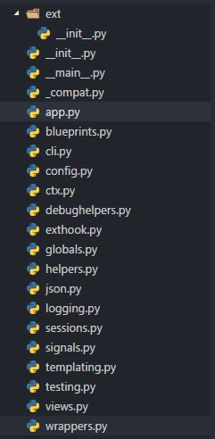

# flask 源码分析

### 网上的文章

http://cizixs.com/2017/01/10/flask-insight-introduction

https://juejin.im/post/5a32513ff265da430f321f3d


### 写在前面

- flask version == 0.12.2


- 看书不起作用也不想看书
- 想造轮子无从下手
- 5月任务
- 没有什么特别的原因

### 开始

#### 目录结构



#### 源码结构

- _compat.py : 兼容
- app.py: 装饰器setupmethod Flask类
- blueprint.py: BlueprintSetupState类 Blueprint类
- cli.py: NoAppException类 Dispatching类 ScriptInfo类 AppGroup类 FlaskGroup类
- config.py: ConfigAttribute类 Config类
- ctx.py: _AppCtxGlobals类 AppContext类 RequestContext类
- debughelper.py: UnexpectedUnicodeError类 DebugFilesKeyError类 FormDataRoutingRedirect类
- exthook.py:  ExtensionImprtWarning ExtensionImport类
- global.py: 一些函数
- helper.py: locked_cached_property类 _PackageBoundObject类
- json.py: JSONEncoder类 JSONDecoder类
- logging.py: 一些logger 类
- session.py: SessionMixin类 taggedJSONSerializer类 SecureCookieSession类 NullSession类 SessionInterface类 SecureCookieSessionInterface类
- signals.py: _FakeSignal类
- templating.py: Environment类 DispatchingJinjaLoader类
- testing.py: FlaskClient类
- views.py: View类 MethodViewType类 MethodView类
- wrappers.py: Request类 Response类

#### 最小的应用

```python
from flask import Flask

app = Flask(__name__)


@app.route('/')
def index():
    return "Hello, World!!"


if __name__ == '__main__':
    app.run()
```


现在来分析这个最小应用中发生了什么

1. 首先是

```python
app = Flask(__name__)
```


```python
# 实例化 Flask class 参数 __name__ 确定资源
# Flask 的 __init__
def __init__(self, import_name, static_path=None, static_url_path=None,
                 static_folder='static', template_folder='templates',
                 instance_path=None, instance_relative_config=False,
                 root_path=None)
# 然后初始化 _PackageBoundObject
_PackageBoundObject.__init__(self, import_name,
                             template_folder=template_folder,
                             root_path=root_path)
```

```python
# 然后在__init__里面定义

 # 实例属性

"""
request_class = Request
response_class = Response
jinja_environment = Environment
app_ctx_globals_class = _AppCtxGlobals
"""
    
"""
self.static_url_path = static_url_path
self.static_folder = static_folder
self.instance_path = instance_path
self.config = self.make_config(instance_relative_config)
self._logger = None
self.logger_name = self.import_name
self.view_functions = {}
self._error_handlers = {}
self.error_handler_spec = {None: self._error_handlers}
self.url_build_error_handlers = []
self.before_request_funcs = {}
self.before_first_request_funcs = []
self.after_request_funcs = {}
self.teardown_request_funcs = {}
self.teardown_appcontext_funcs = []
self.url_value_preprocessors = {}
self.url_default_functions = {}
self.template_context_processors = {
None: [_default_template_ctx_processor]
	}
self.shell_context_processors = []
self.blueprints = {}
self._blueprint_order = []
self.extensions = {}     
self.url_map = Map()
self._got_first_request = False
self._before_request_lock = Lock()
if self.has_static_folder:
self.add_url_rule(self.static_url_path + '/<path:filename>',
	endpoint='static',
	view_func=self.send_static_file)
self.cli = cli.AppGroup(self.name)
 """
 
# 还有在继承于_PackageBoundObject的属性

"""
self.import_name = import_name
self.template_folder = template_folder

if root_path is None:
    root_path = get_root_path(self.import_name)

self.root_path = root_path

self._static_folder = None
self._static_url_path = None	
"""
```


2. 然后是

```python
app.run()
```


```python
# Flask.run
def run(self, host=None, port=None, debug=None, **options):
    from werkzeug.serving import run_simple
    if host is None:
        host = '127.0.0.1'
    if port is None:
        server_name = self.config['SERVER_NAME']
        if server_name and ':' in server_name:
            port = int(server_name.rsplit(':', 1)[1])
        else:
            port = 5000
    if debug is not None:
        self.debug = bool(debug)
    options.setdefault('use_reloader', self.debug)
    options.setdefault('use_debugger', self.debug)
    try:
        run_simple(host, port, self, **options)
    finally:
        # reset the first request information if the development server
        # reset normally.  This makes it possible to restart the server
        # without reloader and that stuff from an interactive shell.
        self._got_first_request = False

```

```python
# 参数
"""
host 主机
port 端口
debug 是否开启debug模式
**operation 其他选项
"""
# 步骤
"""
1. 导入werkzeug库 的 run_simple
2. 确定参数 host port debug operation 的值
3. 运行 run_simple
4. 使 _got_first_request = False
"""
```

3. 最后则是

```python
@app.route('/')
```

```python
# Flask.route
def route(self, rule, **options):
    def decorator(f):
        endpoint = options.pop('endpoint', None)
        self.add_url_rule(rule, endpoint, f, **options)
        return f
    return decorator
```

```python
# 这个route函数是一个类装饰器

"""
# 参数
rule 则是 '/' '/index'
endpoint 如果不指定默认为 None 然后在self.add_url_rule 中 的 _endpoint_from_view_func(view_func) 指定为函数名
f 为视图函数
**operation 为其它选项如 methods 之类
"""
```

```python
# Flask.add_url_rule
@setupmethod
def add_url_rule(self, rule, endpoint=None, view_func=None, **options):
    if endpoint is None:
        endpoint = _endpoint_from_view_func(view_func)
    options['endpoint'] = endpoint
    methods = options.pop('methods', None)

    # if the methods are not given and the view_func object knows its
    # methods we can use that instead.  If neither exists, we go with
    # a tuple of only ``GET`` as default.
    if methods is None:
        methods = getattr(view_func, 'methods', None) or ('GET',)
    if isinstance(methods, string_types):
        raise TypeError('Allowed methods have to be iterables of strings, '
                        'for example: @app.route(..., methods=["POST"])')
    methods = set(item.upper() for item in methods)

    # Methods that should always be added
    required_methods = set(getattr(view_func, 'required_methods', ()))

    # starting with Flask 0.8 the view_func object can disable and
    # force-enable the automatic options handling.
    provide_automatic_options = getattr(view_func,
        'provide_automatic_options', None)

    if provide_automatic_options is None:
        if 'OPTIONS' not in methods:
            provide_automatic_options = True
            required_methods.add('OPTIONS')
        else:
            provide_automatic_options = False

    # Add the required methods now.
    methods |= required_methods

    rule = self.url_rule_class(rule, methods=methods, **options)
    rule.provide_automatic_options = provide_automatic_options

    self.url_map.add(rule)
    if view_func is not None:
        old_func = self.view_functions.get(endpoint)
        if old_func is not None and old_func != view_func:
            raise AssertionError('View function mapping is overwriting an '
                                 'existing endpoint function: %s' % endpoint)
        self.view_functions[endpoint] = view_func
```

```python
# @setupmethod 为自定义的装饰器

# 源码
def setupmethod(f):
    def wrapper_func(self, *args, **kwargs):
        if self.debug and self._got_first_request:
            raise AssertionError('A setup function was called after the '
                'first request was handled.  This usually indicates a bug '
                'in the application where a module was not imported '
                'and decorators or other functionality was called too late.\n'
                'To fix this make sure to import all your view modules, '
                'database models and everything related at a central place '
                'before the application starts serving requests.')
        return f(self, *args, **kwargs)
    return update_wrapper(wrapper_func, f)

# 表明 如果 debug 和 _got_first_request 都为真 抛出异常
```

1. 加载 Flask.route装饰器
2. 确定endpoint
3. Flask.add_url_rule 添加规则

## 功能模块分析

### flask.render_template

