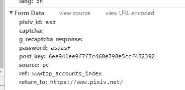

### 模拟登陆Pixiv

1.先随意输入账号和密码


2.点击登录后发现:


3. 查看form data 数据



4. 发现存在post_key 点击查看网页源代码: 发现多个隐藏的form元素


5.正则获取post_key

```python
key = re.search(r'<input type="hidden" name="post_key" value="(.*?)">', html).group(1)
```

6. 拼接url模拟登陆

```python
# 完整代码
import re

import requests


class PixivSpider:
    base_url = "https://accounts.pixiv.net/login?lang=zh&source=pc&view_type=page&ref=wwwtop_accounts_index"
    login_url = "https://accounts.pixiv.net/api/login"
    headers = {"User-Agent": "Mozilla/5.0 (Windows NT 10.0; Win64; x64) Appl"
                             "eWebKit/537.36 (KHTML, like Gecko) Chrome/65.0.3325.181 Safari/537.36"}
    data = {"lang": "zh", "pixiv_id": "", "captcha": "", "g_recaptcha_response": "",
            "password": "", "post_key": "", "source": "pc",
            "ref": "wwwtop_accounts_index", "return_to": "https://www.pixiv.net/"}

    def __init__(self, username, password):
        self.data['pixiv_id'] = username
        self.data['password'] = password
        self.session = requests.Session()

    def _get_id(self):
        html = self.session.get(self.base_url, headers=self.headers).text
        key = re.search(
            r'<input type="hidden" name="post_key" value="(.*?)">', html).group(1)
        return key

    def login_in(self):
        self.data['post_key'] = self._get_id()
        r = self.session.post(self.login_url, headers=self.headers, data=self.data)
        print("登陆状态 %s %s" % (r.status_code, 'OK' if r.status_code == 200 else ''))
```

###总结

对于模拟登陆

最好使用requests.Session, 因为其会自动记录Cookies无需手动录入, 否则需要手动处理cookies,比较麻烦

附上Cookiest图片:

 

### pixiv 爬取今日排行榜前10页

#### 思路

1. 模拟登陆

2. 寻找页面的url, api

3. 下载


- 页数api

  


1.首先获取base_url的页面 https://www.pixiv.net/ranking.php?mode=daily

2 .获取 tt 值

```python
def _get_tt(self):
    r = self.d.down_html("https://www.pixiv.net/ranking.php?mode=daily")
    tt = re.search(r'pixiv.context.token = "(.*?)";', r.text).group(1)
    return tt
```

3. 获取详情页 https://www.pixiv.net/member_illust.php?mode=medium&illust_id=68201385

4. 正则匹配到图片的url和名称

```python
   def get_image(self, url):
       r = self.d.down_html(url)
       image = re.search(r'',
                         r.text)
       if image is None:
           """
           # 这里是漫画
           # url = url.replace('medium', 'manga')
           # self._get_manga(url)
           # image = re.search(r'</div>', r.text)
           """
           return None
       else:
           return image.group(2), image.group(1)
```

5. 获取大图 https://i.pximg.net/img-master/img/2018/04/13/00/00/08/68201385_p0_master1200.jpg

6. 下载

```python
   def down_image(self, referer, url, filename=None):
       if filename:
           filename += '.' + url.split('.')[-1]
           if filename in self.images:
               filename = os.path.basename(url)
       else:
           filename = os.path.basename(url)
       path = './images'
       if not os.path.exists(path):
           os.mkdir(path)
       headers['referer'] = referer
       r = self.d.down_html(url, h=headers)
       with open(os.path.join(path, filename), 'wb') as f:
           f.write(r.content)
       self.images.append(filename)
    print("图片 {} 下载成功".format(filename))
```

7. total: 283个图片


注意事项: 下载图片的时候一开始出现 403 未认证 错误 一开始有些不知所措,  毕竟网站已经登录了

后来通过观察发现

正常:


403: 


修改了request headers 就正常了

```python
# 完整代码
import re
import os
import time

import requests

headers = {"User-Agent": "Mozilla/5.0 (Windows NT 10.0; Win64; x64) Appl"
                         "eWebKit/537.36 (KHTML, like Gecko) Chrome/65.0.3325.181 Safari/537.36"}


class PixivSpider:
    base_url = "https://accounts.pixiv.net/login?lang=zh&source=pc&view_type=page&ref=wwwtop_accounts_index"
    login_url = "https://accounts.pixiv.net/api/login"
    # headers = headers
    data = {"lang": "zh", "pixiv_id": "", "captcha": "", "g_recaptcha_response": "",
            "password": "", "post_key": "", "source": "pc",
            "ref": "wwwtop_accounts_index", "return_to": "https://www.pixiv.net/"}

    def __init__(self, username, password):
        self.data['pixiv_id'] = username
        self.data['password'] = password
        self.images = []
        self.d = DownLoad()

    def _get_id(self):
        r = self.d.down_html(self.base_url)
        key = re.search(
            r'<input type="hidden" name="post_key" value="(.*?)">', r.text).group(1)
        return key

    def login_in(self):
        self.data['post_key'] = self._get_id()
        r = self.d.post_to(self.login_url, data=self.data)
        print("登陆状态 %s %s" % (r.status_code, 'OK' if r and r.status_code == 200 else ''))

    def _get_tt(self):
        r = self.d.down_html("https://www.pixiv.net/ranking.php?mode=daily")
        tt = re.search(r'pixiv.context.token = "(.*?)";', r.text).group(1)
        return tt

    def get_urls(self, p=1):
        # 获取图片的具体url
        url = "https://www.pixiv.net/ranking.php"
        params = {"mode": "daily", "p": p, "format": "json", "tt": ""}
        tt = self._get_tt()
        params['tt'] = tt
        r = self.d.down_html(url, params=params)
        urls = []
        for item in r.json()['contents']:
            urls.append("https://www.pixiv.net/member_illust.php?mode=medium&illust_id=" + str(item['illust_id']))
        return urls

    def _get_manga(self, url):
        r = self.d.down_html(url)
        images = re.findall(
            r'</script><a href="(.*?)" target="_blank" class="full-size-container _ui-tooltip" data-tooltip="显示原图">',
            r.text)
        for i, image in enumerate(images):
            images[i] = "https://www.pixiv.net" + images[i]
        # need return []

    def get_image(self, url):
        r = self.d.down_html(url)
        image = re.search(r'',
                          r.text)
        if image is None:
            """
            # 这里是漫画
            # url = url.replace('medium', 'manga')
            # self._get_manga(url)
            # image = re.search(r'</div>', r.text)
            """
            return None
        else:
            return image.group(2), image.group(1)

    def down_image(self, referer, url, filename=None):
        if filename:
            filename += '.' + url.split('.')[-1]
            if filename in self.images:
                filename = os.path.basename(url)
        else:
            filename = os.path.basename(url)
        path = './images'
        if not os.path.exists(path):
            os.mkdir(path)
        headers['referer'] = referer
        r = self.d.down_html(url, h=headers)
        with open(os.path.join(path, filename), 'wb') as f:
            f.write(r.content)
        self.images.append(filename)
        print("图片 {} 下载成功".format(filename))


class DownLoad:

    def __init__(self):
        self.s = requests.Session()

    def down_html(self, url, n=0, h=headers, params=None):
        try:
            r = self.s.get(url, headers=h, params=params)
        except requests.exceptions.ReadTimeout:
            if n < 5:
                n += 1
                self.down_html(url, n, h)
        except requests.exceptions.ConnectionError:
            if n < 5:
                n += 1
                self.down_html(url, n, h)
        else:
            return r

    def post_to(self, url, data, n=0, h=headers):
        try:
            r = self.s.post(url, headers=h, data=data)
        except requests.exceptions.ReadTimeout:
            if n < 3:
                n += 1
                self.post_to(url, data, n)
            return False
        else:
            return r

    def down_file(self, url, n=0):
        pass


"""
https://www.pixiv.net/ranking.php?mode=daily&p=2&format=json&tt=48e651f09109dd281bd47fc30edec4f3
"""


def d_image(spider, url):
    if spider.get_image(url):
        image_url, image_name = spider.get_image(url)
        try:
            spider.down_image(url, image_url, image_name)
        except OSError:
            print("文件名不可用, 更换文件名")
            spider.down_image(url, image_url)
        except requests.exceptions.ConnectionError as e:
            print(e)
            spider.down_image(url, image_url, image_name)


def main(p=1):
    spider = PixivSpider(username='buglan', password='ls52674364')
    spider.login_in()
    urls = spider.get_urls(p)
    for url in urls:
        try:
            d_image(spider, url)
        except AttributeError as e:
            print(e)
            print('{url} 下载失败'.format(url=url))


if __name__ == '__main__':
    t0 = time.time()
    list(map(main, range(1, 10)))
    print("total is {}".format(time.time() - t0))

```

### 后记

发现缩略图与大图存在关联

首页缩略图的url:

 https://i.pximg.net/c/240x480/img-master/img/2018/04/14/01/04/35/68215883_p0_master1200.jpg

大图的url:

https://i.pximg.net/img-original/img/2018/04/14/01/04/35/68215883_p0.png

即:

```
2018/04/14/01/04/35/68215883_p0_master1200.jpg
2018/04/14/01/04/35/68215883_p0.png
```

我认为可以理解为:

- 2018/04/14/01/04/35/: 为日期

- 68215883: 为图片的编号

- p0: 为第一张图

- master: 为原图

注意:

观察其他图片发现url存在以下区别

- p0_master1200.jpg -> 68215883_p0.png

- 68208926_p0_master1200.jpg -> 68208926_p0.jpg

- 68210030_p0_master1200.jpg -> 68210030_p0_master1200.jpg

由于未发现固有规律: 所以还是使用简单粗暴的方法了

### 解决问题

- 漫画的爬取

- 多张美图的爬取 (只实现了一张的爬取)

#### 1. 思路

- 判断是否存在查看更多


```python
manga = re.search(r'查看更多', r.text)
```

- 拼接字符串

```python
url = url.replace('medium', 'manga')
```

 - 获取列表

```python
images = re.findall(
            r'data-src="(.*?)" data-index="\d+">',
            r.text)
```

- 异常处理

```python
try:
pass
except AttributeError:
    for i, u in enumerate(image_url):
    spider.down_image(url, u, filename=image_name + '-' + str(i))
```

#### 2. 具体代码


```python
import re
import os
import time
from concurrent import futures

import requests

headers = {"User-Agent": "Mozilla/5.0 (Windows NT 10.0; Win64; x64) Appl"
                         "eWebKit/537.36 (KHTML, like Gecko) Chrome/65.0.3325.181 Safari/537.36"}


class PixivSpider:
    base_url = "https://accounts.pixiv.net/login?lang=zh&source=pc&view_type=page&ref=wwwtop_accounts_index"

    login_url = "https://accounts.pixiv.net/api/login"

    # headers = headers

    data = {"lang": "zh", "pixiv_id": "", "captcha": "", "g_recaptcha_response": "",

            "password": "", "post_key": "", "source": "pc",

            "ref": "wwwtop_accounts_index", "return_to": "https://www.pixiv.net/"}

    def __init__(self, username, password):
        self.data['pixiv_id'] = username
        self.data['password'] = password
        self.images = []
        self.d = DownLoad()

    def _get_id(self):
        r = self.d.down_html(self.base_url)
        key = re.search(
            r'<input type="hidden" name="post_key" value="(.*?)">', r.text).group(1)
        return key

    def login_in(self):
        self.data['post_key'] = self._get_id()
        r = self.d.post_to(self.login_url, data=self.data)
        print("登陆状态 %s %s" % (r.status_code, 'OK' if r and r.status_code == 200 else ''))

    def _get_tt(self):
        r = self.d.down_html("https://www.pixiv.net/ranking.php?mode=daily")
        tt = re.search(r'pixiv.context.token = "(.*?)";', r.text).group(1)
        return tt

    def get_urls(self, p=1):
        # 获取图片的具体url
        url = "https://www.pixiv.net/ranking.php"
        params = {"mode": "daily", "p": p, "format": "json", "tt": ""}
        tt = self._get_tt()
        params['tt'] = tt
        r = self.d.down_html(url, params=params)
        urls = []
        for item in r.json()['contents']:
            urls.append("https://www.pixiv.net/member_illust.php?mode=medium&illust_id=" + str(item['illust_id']))
        return urls

    def _get_manga(self, url):
        r = self.d.down_html(url)
        images = re.findall(
            r'data-src="(.*?)" data-index="\d+">',
            r.text)
        return images

    def get_image(self, url):
        r = self.d.down_html(url)
        manga = re.search(r'查看更多', r.text)
        if manga:
            url = url.replace('medium', 'manga')
            images = self._get_manga(url)
            name = re.search(r'<h1 class="title">(.*?)</h1>', r.text).group(1)
            return images, name
        else:
            image = re.search(r'',
                              r.text)
        return image.group(2), image.group(1)

    def down_image(self, referer, url, filename=None):
        if filename:
            filename += '.' + url.split('.')[-1]
            if filename in self.images:
                filename = os.path.basename(url)
        else:
            filename = os.path.basename(url)
        path = './images'
        if not os.path.exists(path):
            os.mkdir(path)
        headers['referer'] = referer
        r = self.d.down_html(url, headers=headers)
        with open(os.path.join(path, filename), 'wb') as f:
            f.write(r.content)
        self.images.append(filename)
        print("图片 {} 下载成功".format(filename))


class DownLoad:

    def __init__(self):
        self.s = requests.Session()

    def down_html(self, url, n=0, **kwargs):
        try:
            r = self.s.get(url, **kwargs)
        except requests.exceptions.ReadTimeout:
            if n < 5:
                n += 1
                self.down_html(url, n, **kwargs)
        except requests.exceptions.ConnectionError:
            if n < 5:
                n += 1
                self.down_html(url, n, **kwargs)
        else:
            return r

    def post_to(self, url, n=0, **kwargs):
        try:
            r = self.s.post(url, **kwargs)
        except requests.exceptions.ReadTimeout:
            if n < 3:
                n += 1
                self.post_to(url, n, **kwargs)
            return False
        else:
            return r

    def down_file(self, url, n=0):
        pass


def d_image(spider, url):
    if spider.get_image(url):

        image_url, image_name = spider.get_image(url)

        try:

            spider.down_image(url, image_url, image_name)

        except OSError:

            print("文件名不可用, 更换文件名")

            spider.down_image(url, image_url)

        except requests.exceptions.ConnectionError as e:

            print(e)

            spider.down_image(url, image_url, image_name)

        except AttributeError:

            for i, u in enumerate(image_url):
                spider.down_image(url, u, filename=image_name + '-' + str(i))


def d_image(spider, url):
    if spider.get_image(url):

        image_url, image_name = spider.get_image(url)
        try:
            spider.down_image(url, image_url, image_name)
        except OSError:
            print("文件名不可用, 更换文件名")
            spider.down_image(url, image_url)
        except requests.exceptions.ConnectionError as e:
            print(e)
            spider.down_image(url, image_url, image_name)
        except AttributeError:
            for i, u in enumerate(image_url):
                spider.down_image(url, u, filename=image_name + '-' + str(i))


def main(p=1):
    spider = PixivSpider(username='buglan', password='ls52674364')
    spider.login_in()
    urls = spider.get_urls(p)
    for url in urls:
        try:
            d_image(spider, url)
        except Exception as e:
            print('{e} {url} 下载失败'.format(e=e, url=url))


if __name__ == '__main__':
    t0 = time.time()

    list(map(main, range(1, 11)))


```

- 多线程


```python

    # ...

def main(p=1):
    urls = spider.get_urls(p)
    for url in urls:
        try:
            d_image(spider, url)
        except Exception as e:
            print('{e} {url} 下载失败'.format(e=e, url=url))


if __name__ == '__main__':
    t0 = time.time()
    spider = PixivSpider(username='buglan', password='ls52674364')
    spider.login_in()
    with futures.ThreadPoolExecutor(max_workers=20) as executor:
        executor.map(main, range(1, 11))
        print("total is {}".format(time.time() - t0))
  ```

花费时间:


  - 改进多线程

    > 模块化划分, 由一张图片顺序的爬取 第一页 -> 第一张图片的大图 -> 下载该图片 -> 循环
    >
    > 改为先获取所有的图片地址在进行下载 -> 获取所需页数 -> 获取所有大图 -> 开始下载

  - 多进程搭配协程


