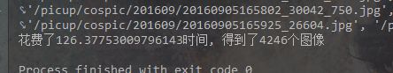
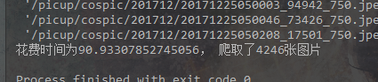
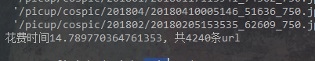
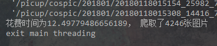
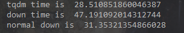
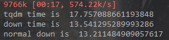
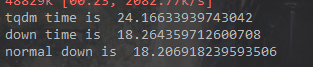

# 单/多线程对比


### 单线程爬取CosplayLa 最新10页全部大图的URL

```python
# get_image_url_single.py
import re
import time

from Support import *

URL = "http://www.cosplayla.com/picture-4/"
BASE_URL = "http://www.cosplayla.com"
pic_urls = []


def parser_page(url):
    # url = "http://www.cosplayla.com/picture-4/?page=1"
    html = DownloadPage(url)
    need_handle_url = re.findall(r'<li class="t"><a href="(.*?)" target="_blank">', html)
    for url in need_handle_url:
        parser_html(url)

    # return None


def parser_html(url):
    url = BASE_URL + url
    html = DownloadPage(url)
    pics = re.findall(r'', html)
    global pic_urls
    pics = list(set(pics))
    pic_urls += pics

    # return None


def main():
    url = "http://www.cosplayla.com/picture-4/?page="
    for n in range(1, 11):
        parser_page(url + str(n))


if __name__ == '__main__':
    t0 = time.time()
    main()
    print(pic_urls)
    print("花费了{}时间, 得到了{}个图像".format(time.time() - t0, len(pic_urls)))

```

```python
# Support.py
import requests


def DownloadPage(url):
    headers = {
        "User-Agent": "Mozilla/5.0 (Windows NT 10.0; Win64; x64) AppleWebKit/53"
                      "7.36 (KHTML, like Gecko) Chrome/62.0.3202.94 Safari/537.36"
    }
    while True:
        try:
            r = requests.get(url, headers=headers, timeout=3)
            r.raise_for_status()
        except:
            print("Link Error")
        else:
            r.encoding = r.apparent_encoding
            return r.text


def DownloadFile(url, filepath):
    headers = {
        "User-Agent": "Mozilla/5.0 (Windows NT 10.0; Win64; x64) AppleWebKit/53"
                      "7.36 (KHTML, like Gecko) Chrome/62.0.3202.94 Safari/537.36"
    }
    num = 2
    while num > 0:
        try:
            r = requests.get(url, headers=headers, timeout=10)
            r.raise_for_status()
        except:
            print(url + "Download Fail")
            num = num - 1
        else:
            with open(filepath, "wb") as f:
                f.write(r.content)
            return True
```

### 花费时间



### 简单多线程

```python
# get_image_url_threading.py
import re
import time
import threading

from Support import *

pic_urls = []
url = "http://www.cosplayla.com/picture-4/?page="
BASE_URL = "http://www.cosplayla.com"


def parser_page(url):
    # url = "http://www.cosplayla.com/picture-4/?page=1"
    html = DownloadPage(url)
    need_handle_url = re.findall(r'<li class="t"><a href="(.*?)" target="_blank">', html)
    for url in need_handle_url:
        parser_html(url)


def parser_html(url):
    url = BASE_URL + url
    html = DownloadPage(url)
    pics = re.findall(r'', html)
    global pic_urls
    pics = list(set(pics))
    pic_urls += pics


class ThreadUrl(threading.Thread):
    def __init__(self, thread_name, i):
        threading.Thread.__init__(self)
        self.thread_name = thread_name
        self.i = i

    def run(self):
        parser_page(url + str(self.i))


def main():
    t0 = time.time()
    threads = [ThreadUrl(i, i) for i in range(1, 11)]
    for t in threads:
        t.start()

    for t in threads:
        t.join()
    print(pic_urls)
    print("花费时间为{}， 爬取了{}张图片".format(time.time() - t0, len(pic_urls)))


if __name__ == '__main__':
    main()

```

###  花费时间



### 相关

1. 这个多线程提升的速度并不大仅仅提升了30多秒 原因是我没有优化好多线程的程序
2. python存在GIL 同一时间只允许一个线程 所以Python的线程不是真正的线程
3. 爬虫主要是网络连接 I/O 密集 可以优化速度 当前线程在等待返回时，切换到其他线程

### 特点

单线程

1.依次连接网络

2.进行连接的时候等待响应

多线程

1.正在执行的线程如果等待则更换线程

2.线程之间的切换是随机的


### 优化过的多线程程序

```python
# get_image_url_threading2.py
import threading
from queue import Queue
import requests
import re
import time

URL = []


class ThreadHtml(threading.Thread):
    def __init__(self, thread_id, page):
        threading.Thread.__init__(self)
        self.thread_id = thread_id
        self.page = page
        self.queue = None

    def run(self):
        # 这个程序爬取url并将其存到队列里面
        # 抓取每一页的url
        cosplayla = CosplayLa()
        cosplayla.get_urls(page=self.page)
        while True:
            try:
                cosplayla.parser()
            except IndexError as e:
                break
        self.queue = cosplayla.queue
        print('end {}'.format(self.thread_id))


class CosplayLa:
    def __init__(self, ):
        self._root_url = 'http://www.cosplayla.com/picture-4/'
        self.urls = []
        self.download = DownLoad()
        self.queue = Queue()

    def get_urls(self, page):
        context = self.download.download_page(self._root_url, {"page": page})
        urls = re.findall('<div class="pic"><a href="(.*?)" target="_blank">', context)
        self.urls = urls
        return urls

    def parser(self):
        url = 'http://www.cosplayla.com' + self.urls.pop()
        context = requests.get(url, headers={
            "User-Agent": "Mozilla/5.0 (Windows NT 10.0; Win64; x64) AppleWebKit/53"
                          "7.36 (KHTML, like Gecko) Chrome/62.0.3202.94 Safari/537.36"
        }).text
        urls = re.findall('', context)
        for url in urls:
            if url == '/picup/':
                urls.remove(url)
            else:
                self.queue.put(url)
        global URL
        URL += urls
        return self.queue

    def start(self):
        t0 = time.time()
        threads = [ThreadHtml(thread_id=i, page=i) for i in range(1, 11)]
        for t in threads:
            print("start {}".format(t.thread_id))
            t.start()
        for t in threads:
            t.join()
        url = list(set(URL))
        print(url)
        print("花费时间{}, 共{}条url".format(time.time() - t0, len(url)))

        # 开启10个线程


class DownLoad:
    def __init__(self):
        self._headers = {"User-Agent": "Mozilla/5.0 (Windows NT 10.0; Win64; x64) AppleWebKit/53"
                                       "7.36 (KHTML, like Gecko) Chrome/62.0.3202.94 Safari/537.36"}
        self._timeout = 10

    def download_page(self, url, page):
        n = 5
        while n > 0:
            try:
                r = requests.get(url, params=page, headers=self._headers, timeout=self._timeout)
            except requests.exceptions.ReadTimeout:
                n -= 1
            else:
                r.encoding = r.apparent_encoding
                return r.text


if __name__ == '__main__':
    cosplayla = CosplayLa()
    cosplayla.start()
```

### 花费时间




速度比第一种快了9倍

比第二种快了5倍


### 后言

后来发现第二种多线程慢的原因是

```python
r.encoding = r.apparent_encoding
```

编码转换是计算密集型

使用多线程还不如单线程快 => 线程切换花费了大量的时间


```python
# 修改后的
import re
import time
import threading
import requests

from queue import Queue

queue = Queue()
url = "http://www.cosplayla.com/picture-4/?page="
BASE_URL = "http://www.cosplayla.com"


def parser_page(url):
    # url = "http://www.cosplayla.com/picture-4/?page=1"
    html = DownLoad().download_page(url)
    need_handle_url = re.findall(r'<li class="t"><a href="(.*?)" target="_blank">', html)
    return need_handle_url


def parser_html(url):
    url = BASE_URL + url
    context = DownLoad().download_page(url)
    pics = re.findall('', context)
    pics = list(set(pics))
    for pic in pics:
        queue.put(pic)


class ThreadUrl(threading.Thread):
    def __init__(self, thread_name, i):
        threading.Thread.__init__(self)
        self.thread_name = thread_name
        self.i = i

    def run(self):
        global url
        urls = parser_page(url + str(self.i))
        for url in urls:
            parser_html(url)


class DownLoad:
    def __init__(self):
        self._headers = {"User-Agent": "Mozilla/5.0 (Windows NT 10.0; Win64; x64) AppleWebKit/53"
                                       "7.36 (KHTML, like Gecko) Chrome/62.0.3202.94 Safari/537.36"}
        self._timeout = 10

    def download_page(self, url):
        # n = 5
        # while n > 0:
        #     try:
        #         r = requests.get(url, headers=self._headers, timeout=self._timeout)
        #     except requests.exceptions.ReadTimeout:
        #         n -= 1
        #     else:
        #         r.encoding = r.apparent_encoding
        #         return r.text
        """
        注意 ‘r.encoding = r.apparent_encoding’
        这行操作是cpu密集型
        多线程下会减慢速度
        在这个程序中如果不加的话所需时间为12.5秒左右
        加了的话 为36秒
        """
        try:
            text = requests.get(url, headers=self._headers, timeout=self._timeout).text
        except requests.exceptions.ReadTimeout as e:
            print(e)
            return self.download_page(url)
        else:
            return text


def main():
    t0 = time.time()
    threads = [ThreadUrl(i, i) for i in range(1, 11)]
    for t in threads:
        print(t.thread_name)
        t.start()

    for t in threads:
        t.join()
    urls = []
    while True:
        if queue.empty():
            break
        urls.append(queue.get())
    print(urls)
    print("花费时间为{}， 爬取了{}张图片".format(time.time() - t0, len(urls)))
    print('exit main threading')


if __name__ == '__main__':
    main()
```

这种方式利用了队列先进先出 线程安全的特性

### 花费时间



## 下载图片

```
url.txt
...
存储了上面程序生成的url
```

### 单线程

```python
import os
import time

import requests
from queue import Queue

queue = Queue()
file = './url.txt'
BASE_URL = 'http://www.cosplayla.com'


def init():
    # 将url.txt里面的url存储到队列中
    with open(file, 'r') as f:
        for line in f:
            queue.put(line.replace('\n', ''))


def download(url, n=0):
    try:
        r = requests.get(url, headers={"User-Agent": "Mozilla/5.0 (Windows NT 10.0; Win64; x64) AppleWebKit/53"
                                                     "7.36 (KHTML, like Gecko) Chrome/62.0.3202.94 Safari/537.36"})
    except requests.exceptions.ReadTimeout as e:
        print(e)
        if n <= 3:
            n += 1
            download(url, n)
    else:
        filename = os.path.basename(url)
        path = os.path.join('./images', filename)
        if not os.path.exists('./images'):
            os.makedirs('./images')
        try:
            with open(path, 'wb') as f:
                f.write(r.content)
        except FileNotFoundError:
            print("{}下载失败".format(filename))
        else:
            print("下载{}成功".format(filename))


def main():
    t0 = time.time()
    init()
    print("存储到花费队列中花费{}秒".format(time.time() - t0))
    t1 = time.time()
    while True:
        if queue.empty():
            break
        url = BASE_URL + queue.get()
        download(url)
    print("共用{}秒".format(time.time() - t1))
    # 21:01 --> 21:36
    # 花费35分钟下载4239张图片


if __name__ == '__main__':
    main()

```

花费时间: 35 m

### 多线程版本

```python
import os
import time
import threading

import requests
from queue import Queue

queue = Queue()
file = './url.txt'
BASE_URL = 'http://www.cosplayla.com'


def init():
    # 将url.txt里面的url存储到队列中
    with open(file, 'r') as f:
        for line in f:
            queue.put(line.replace('\n', ''))


def download(url, n=0):
    try:
        r = requests.get(url, headers={"User-Agent": "Mozilla/5.0 (Windows NT 10.0; Win64; x64) AppleWebKit/53"
                                                     "7.36 (KHTML, like Gecko) Chrome/62.0.3202.94 Safari/537.36"})
    except requests.exceptions.ReadTimeout as e:
        print(e)
        if n <= 3:
            n += 1
            download(url, n)
    else:
        filename = os.path.basename(url)
        path = os.path.join('./images', filename)
        if not os.path.exists('./images'):
            os.makedirs('./images')
        try:
            with open(path, 'wb') as f:
                f.write(r.content)
        except FileNotFoundError:
            print("{}下载失败".format(filename))
        else:
            print("下载{}成功".format(filename))


class ThreadDownLoad(threading.Thread):
    def __init__(self, thread_name):
        threading.Thread.__init__(self)
        self.thread_name = thread_name

    def run(self):
        while True:
            if queue.empty():
                break
            download(url=BASE_URL + queue.get())


def main():
    t0 = time.time()
    init()
    print("存储到花费队列中花费{}秒".format(time.time() - t0))
    t1 = time.time()
    threads = [ThreadDownLoad('thread' + str(i)) for i in range(1, 11)]
    for t in threads:
        t.start()
    for t in threads:
        t.join()

    print("共用{}秒".format(time.time() - t1))
    # 74.7秒


if __name__ == '__main__':
    main()

```

花费时间： 74.7s


### 相互结合

```python
import os
import re
import time
import threading

import requests
from queue import Queue

queue = Queue()
url = "http://www.cosplayla.com/picture-4/?page="
BASE_URL = "http://www.cosplayla.com"


def parser_page(url):
    # url = "http://www.cosplayla.com/picture-4/?page=1"
    html = DownLoad().download_page(url)
    need_handle_url = re.findall(r'<li class="t"><a href="(.*?)" target="_blank">', html)
    return need_handle_url


def parser_html(url):
    url = BASE_URL + url
    context = DownLoad().download_page(url)
    pics = re.findall('', context)
    pics = list(set(pics))
    for pic in pics:
        queue.put(pic)


def download(url, n=0):
    try:
        r = requests.get(url, headers={"User-Agent": "Mozilla/5.0 (Windows NT 10.0; Win64; x64) AppleWebKit/53"
                                                     "7.36 (KHTML, like Gecko) Chrome/62.0.3202.94 Safari/537.36"})
    except requests.exceptions.ReadTimeout as e:
        print(e)
        if n <= 3:
            n += 1
            download(url, n)
    else:
        filename = os.path.basename(url)
        path = os.path.join('./images', filename)
        if not os.path.exists('./images'):
            os.makedirs('./images')
        try:
            with open(path, 'wb') as f:
                f.write(r.content)
        except FileNotFoundError:
            print("{}下载失败".format(filename))
        else:
            print("下载{}成功".format(filename))


class ThreadUrl(threading.Thread):
    def __init__(self, thread_name, i):
        threading.Thread.__init__(self)
        self.thread_name = thread_name
        self.i = i

    def run(self):
        global url
        urls = parser_page(url + str(self.i))
        for url in urls:
            parser_html(url)


class ThreadDownLoad(threading.Thread):
    def __init__(self, thread_name):
        threading.Thread.__init__(self)
        self.thread_name = thread_name

    def run(self):
        while True:
            if queue.empty():
                break
            download(url=BASE_URL + queue.get())


class DownLoad:
    def __init__(self):
        self._headers = {"User-Agent": "Mozilla/5.0 (Windows NT 10.0; Win64; x64) AppleWebKit/53"
                                       "7.36 (KHTML, like Gecko) Chrome/62.0.3202.94 Safari/537.36"}
        self._timeout = 10

    def download_page(self, url):
        # n = 5
        # while n > 0:
        #     try:
        #         r = requests.get(url, headers=self._headers, timeout=self._timeout)
        #     except requests.exceptions.ReadTimeout:
        #         n -= 1
        #     else:
        #         r.encoding = r.apparent_encoding
        #         return r.text
        """
        注意 ‘r.encoding = r.apparent_encoding’
        这行操作是cpu密集型
        多线程下会减慢速度
        在这个程序中如果不加的话所需时间为12.5秒左右
        加了的话 为36秒
        """
        try:
            r = requests.get(url, headers=self._headers, timeout=self._timeout)
        except requests.exceptions.ReadTimeout as e:
            print(e)
            return self.download_page(url)
        else:
            return r.text


def main():
    t0 = time.time()
    threads = [ThreadUrl(i, i) for i in range(1, 11)]
    for t in threads:
        print(t.thread_name)
        t.start()

    for t in threads:
        t.join()

    print("花费时间为{}秒".format(time.time() - t0))
    ts = [ThreadDownLoad(i) for i in range(1, 11)]
    t1 = time.time()
    for t in ts:
        t.start()

    for t in ts:
        t.join()
    print("下载花费时间为{}秒".format(time.time() - t1))
    print('exit main threading')


if __name__ == '__main__':
    main()

```

花费时间： 10s + 77s = 87s


### 思考： 开多少线程合适

我对这个程序实验分别开启100， 8， 10， 11， 12 个线程

1. 100 线程花费时间最大5m
2. 10 线程 72s
3. 11 线程 80s
4. 12 线程77s
5. 8 线程 89s

在网上询问：对于java程序来说开 2N 或者 2N + 2 个线程（N为cpu核心数）


> 一般如果是io密集型，每个cpu开两个线程，这个在java著名框架netty源码里面有。如果是cpu密集型，建议每个cpu开一个。


windows 上可以打开资源管理器结合网络带宽来确定开多少个线程

### 多线程下载

测试url(10m): http://dg.101.hk/1.rar



第一个tqdm流形式

第二个流形式

第三个普通存到内存中

可以看到相差无几 其中差异取决于网路波动


现在使用多线程

- 5个线程


- 20个线程


- 10 个线程

  

出现耗费时间差距不大是网络的原因

现在更换网络更好的大文件来尝试下

http://ping.online.net/10Mo.dat




http://ping.online.net/50Mo.dat



多线程下载思路:

- 大文件使用流的形式下载
- 使用f.seek() 确保文件数据的位置
- 发送头文件确定传输字节的位置 headers = {'Range': "bytes=%s-%s" % (start, end)}
- r = requests.head(url) 获取数据的头信息
- 确定每一段数据的start 和 end 位置


```python
# 完整代码
import requests
import os
import time

import threading

url = 'http://dg.101.hk/1.rar'

r = requests.get(url, stream=True)


def down(start, end, url):
    headers = {'Range': "bytes=%s-%s" % (start, end)}
    r = requests.get(url, stream=True, headers=headers)
    with open(os.path.basename(url), 'wb') as f:
        f.seek(start)
        f.write(r.content)


def main(n, url=url):
    r = requests.head(url)
    file_size = int(r.headers['content-length'])
    part = file_size // n
    for i in range(n):
        start = part * i
        if i == n - 1:
            end = file_size
        else:
            end = start + part

        t = threading.Thread(target=down, kwargs={'start': start, 'end': end, 'url': url})
        t.start()
    main_thread = threading.current_thread()
    for t in threading.enumerate():
        if t is main_thread:
            continue
        t.join()


if __name__ == '__main__':
    t0 = time.time()
    main(10)
    print('total time is ', time.time() - t0)
```


### 后记

感觉多线程下载带来了提升并没有想象中的大

也许是我的理解错了吧

