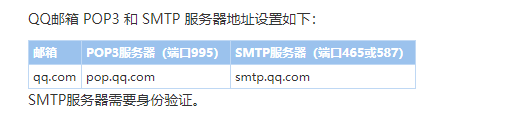
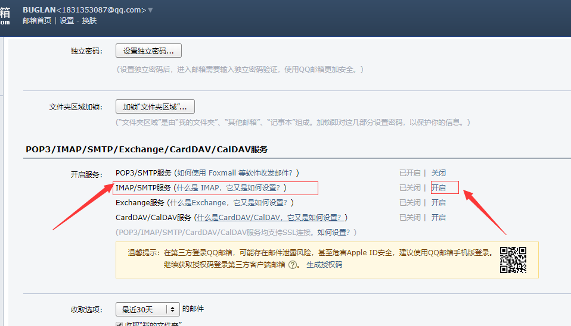

### 相关设置

1.

2. 


### 发送邮件

```python
def send_email(to):
    import smtplib
    from email.mime.text import MIMEText
    from email.header import Header
    _user = "1831353087@qq.com"
    _pwd = "jmdqkdndaeqtcagh" # 需要的密码是相关设置中开启IMAP/SMTP 的授权码
    _to = to

    # 使用MIMEText构造符合smtp协议的header及body
    msg = MIMEText('上架了新货, 快去撸吧 {}'.format(BASE_URL + check_items[0]))
    msg["Subject"] = Header("buglan自动提醒", charset='utf-8')
    msg["From"] = _user
    msg["To"] = _to

    s = smtplib.SMTP_SSL("smtp.qq.com", timeout=5, port=465)  # 连接smtp邮件服务器,端口默认是25
    s.login(_user, _pwd)  # 登陆服务器
    try:
        s.sendmail(_user, _to, msg.as_string())  # 发送邮件
    finally:
        s.close()

 
```

